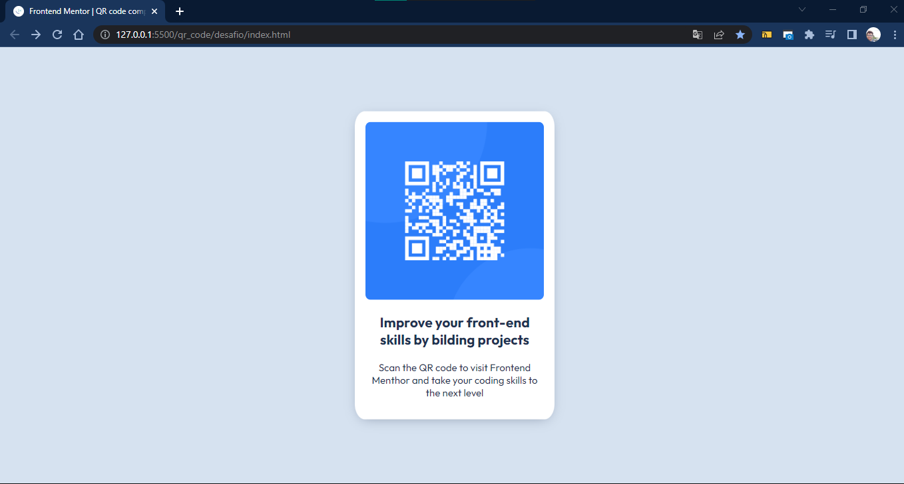

# Frontend Mentor - QR code component solution

This is a solution to the [QR code component challenge on Frontend Mentor](https://www.frontendmentor.io/challenges/qr-code-component-iux_sIO_H). Frontend Mentor challenges help you improve your coding skills by building realistic projects.

## Table of contents

- [Overview](#overview)
  - [Screenshot](#screenshot)
- [My process](#my-process)
  - [Built with](#built-with)
  - [What I learned](#what-i-learned)
  - [Continued development](#continued-development)
- [Author](#author)

## Overview

### Screenshot



### Responsive Screenshot


## My process

### Built with

- Semantic HTML5 markup
- CSS custom properties

### What I learned

One of the main things I learned was about centralizing without Flex Box or Grids, by using some concepts about the use of "position: absolute";

```css
    position: absolute;
    top: 50%;
    left: 50%;
    transform: translate(-50%, -50%);
```

### Continued development

This was one of the ways I learned how to centralize, which was one of my biggest challenges in this project, cause I'm a beginner. I pretend to delve deeper into techniques involving CSS Flex Box and Grid in the future and updates my techniques.

## Author

- LinkedIn - [Alexander Pastana](https://www.linkedin.com/in/alexanderpastana/)
- Frontend Mentor - [@alexander-pastana](https://www.frontendmentor.io/profile/alexander-pastana)
- Instagram - [@alexlealp](https://www.instagram.com/alexlealp/)
